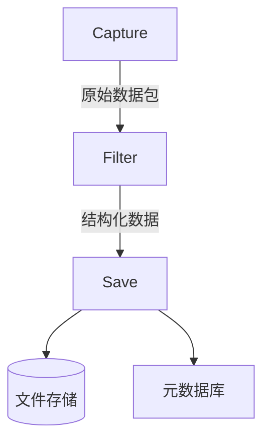
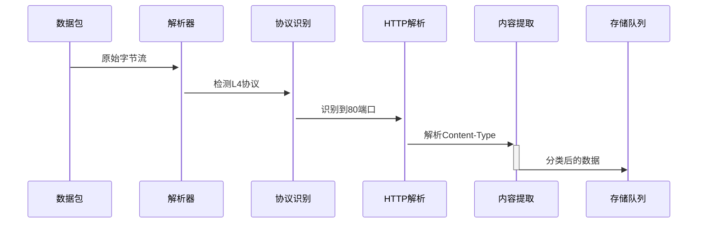

# 流量内容还原系统设计文档

## 一、项目概述

### 1.1 设计目标
- 实时捕获网卡流量
- 解析HTTP/FTP/DNS等常见协议
- 提取并还原文本（HTML/JSON）、图片（JPEG/PNG）、视频（MP4/FLV）
- 存储提取内容并生成元数据

### 1.2 系统架构


## 二、模块详细设计

### 2.1 Capture模块

#### 技术方案
| 组件        | 选型           | 性能指标       |
|-------------|----------------|----------------|
| 抓包引擎    | libpcap (C++实现) | 吞吐量≥800Mbps |
| 流量过滤    | BPF过滤器      | 过滤效率≥95%   |
| 队列管理    | 环形缓冲区      | 容量=2MB       |

#### 关键数据结构
```cpp
struct RawPacket {
    timeval timestamp;  // 时间戳
    uint32_t caplen;    // 捕获长度
    uint8_t data[];     // 原始数据
};
```

#### 接口定义
```python
def start_capture(interface: str, 
                 bpf_filter: str = "tcp or udp",
                 callback: Callable[[bytes], None]):
    """启动抓包并注册回调函数"""
```

### 2.2 Filter模块

#### 协议解析流程


#### 内容识别算法
```python
def detect_content_type(data: bytes) -> str:
    # 文件头特征检测
    signatures = {
        b'\xFF\xD8\xFF': 'image/jpeg',
        b'\x89PNG': 'image/png',
        b'ftyp': 'video/mp4'
    }
    for sig, mime in signatures.items():
        if data.startswith(sig):
            return mime
    # 备用MIME检测
    return magic.from_buffer(data, mime=True)
```

### 2.3 Save模块

#### 存储方案设计
| 内容类型  | 存储策略          | 去重机制          |
|-----------|-------------------|-------------------|
| 文本      | 按时间分片（每小时1文件） | SHA-1哈希比对    |
| 图片      | 独立文件存储      | 相似图片聚类      |
| 视频      | 分块存储（每段≤50MB） | 流ID关联          |

#### 元数据格式
```json
{
  "file_id": "VID_20230315_142022",
  "source_ip": "192.168.1.100",
  "timestamp": "2023-03-15T14:20:22Z",
  "content_type": "video/mp4",
  "size": 1048576,
  "related_flows": ["TCP_192.168.1.100:443"]
}
```

## 三、关键技术指标

### 3.1 性能要求
| 指标               | 目标值           | 测量方法             |
|--------------------|------------------|----------------------|
| 数据包处理延迟     | ≤5ms/packet      | 时间戳差值统计       |
| 视频还原完整率     | ≥98%             | 测试数据集校验       |
| 内存占用峰值       | ≤500MB           | Valgrind检测         |

### 3.2 可靠性设计
- 数据完整性：CRC32校验每段数据
- 断点续传：定期保存处理进度
- 异常处理：隔离崩溃的解析线程

## 四、扩展性设计

### 4.1 插件架构
```python
class ProtocolPlugin:
    @abstractmethod
    def detect(self, pkt: bytes) -> bool: ...
    
    @abstractmethod
    def process(self, pkt: bytes) -> dict: ...

# 示例：注册WebSocket插件
register_plugin(WebSocketPlugin())
```

### 4.2 可扩展协议支持
| 协议类型  | 开发优先级 | 依赖库        |
|-----------|------------|---------------|
| HTTP/1.1  | P0         | 内置解析      |
| QUIC      | P2         | ngtcp2        |
| RTMP      | P1         | librtmp       |

## 五、测试方案

### 5.1 单元测试用例
```python
def test_jpeg_reassembly():
    # 构造分片JPEG数据包
    packets = generate_fragmented_jpeg()  
    for pkt in packets:
        process_packet(pkt)
    assert os.path.exists("output/image_123.jpg")
```

### 5.2 性能测试场景
```bash
# 使用tcpreplay注入流量
$ tcpreplay --loop=1000 --mbps=500 test.pcap
# 监控资源使用
$ dstat -cmt --top-mem
```

## 六、风险与应对

| 风险项           | 应对措施                         |
|------------------|----------------------------------|
| HTTPS内容无法解析 | 提供证书导入功能                 |
| 大流量内存溢出   | 实现磁盘缓存回退机制             |
| 私有协议识别失败 | 开放自定义特征码配置接口         |

## 附录A：依赖项清单
- libpcap 1.10.1+
- OpenSSL 3.0 (可选TLS支持)
- SQLite 3.35+ (元数据存储)

该文档可作为开发基础框架，建议配合原型代码同步迭代更新。下一步应优先实现HTTP明文流量的基础还原功能，再逐步扩展其他协议支持。